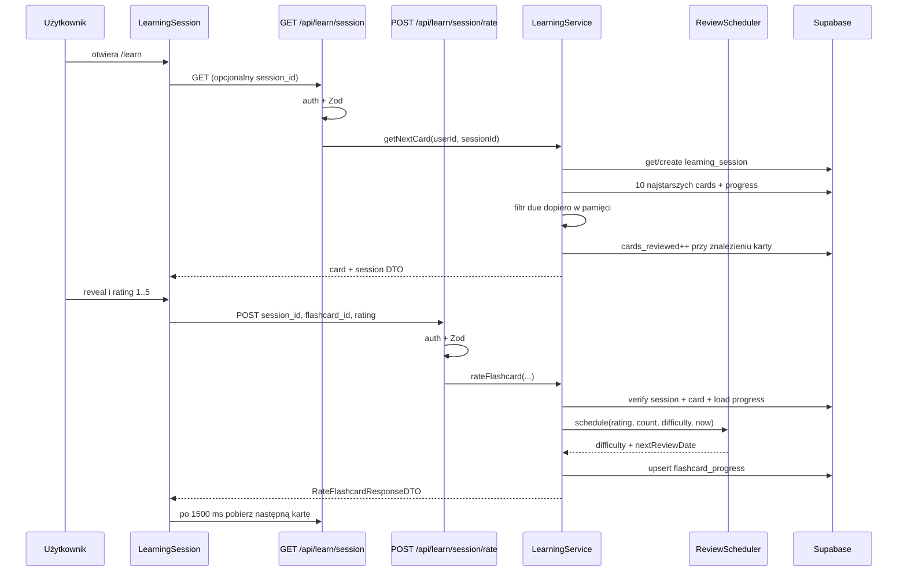

# Research: learning-progress-analysis

Analiza wykonana na HEAD gałęzi `master` przed małą fazą wydzielenia `ReviewScheduler`. Refaktor nie zmienił opisanych endpointów ani zachowania; aktualne linie uwzględniają wydzielony plik schedulera.

## Feature overview

Użytkownik otwiera `/learn`. Reactowy `LearningSession` pobiera kartę przez `GET /api/learn/session`; bez `session_id` serwis tworzy sesję, a przy kolejnych kartach weryfikuje aktywną sesję użytkownika. Karta jest odwracana lokalnie. Rating 1–5 trafia do `POST /api/learn/session/rate`, jest walidowany przez Zod, po czym serwis weryfikuje właściciela sesji i karty, oblicza trudność/następną datę i wykonuje upsert `flashcard_progress`.

Intencja produktu: `.ai/prd.md:109-119` wymaga widoku nauki, reveal, ratingu, wyboru kolejnej karty i zapisu postępu. Szczegółowy plan rate endpointu mówi o aktualizacji statystyk sesji po ratingu (`.ai/api-impl-post-learn-session-rate.md:88-101`). Aktualny kod zwiększa licznik wcześniej, podczas GET.

### Trace E2E



### Trace z dowodami

1. Entry point: `src/pages/learn.astro:4,14`.
2. Pierwszy GET i przechowanie DTO: `LearningSession.tsx:23-47`.
3. Auth, parametr `session_id`, Zod: `session.ts:6-24,63-66`.
4. Get/create sesji: `learning.service.ts:11-39`.
5. Query kart: `learning.service.ts:45-60`.
6. Filter due i wybór `[0]`: `learning.service.ts:62-89`.
7. Zwiększenie licznika: `learning.service.ts:91-100`.
8. Reveal/rating w UI: `LearningCard.tsx:21-23,111-126`.
9. POST ratingu: `LearningSession.tsx:55-83`.
10. Auth + Zod rate: `session/rate.ts:6-29` i `learning.schema.ts:7-11`.
11. Weryfikacja sesji/karty: `learning.service.ts:128-157`.
12. Harmonogram i upsert: `learning.service.ts:159-193`, czyste reguły `review-scheduler.ts:12-42`.
13. Odpowiedź zachowuje DTO: `learning.service.ts:198-208`, `src/types.ts:144-154`.

## Test gaps

| Zachowanie / niezmiennik | Istniejący test | Ocena luki |
|---|---|---|
| reveal i pięć przycisków | `LearningCard.test.tsx` | chronione na poziomie komponentu |
| rating 1..5 w schemacie API | schema istnieje; API tests używają atrap | brak bezpośredniego testu handlera |
| matematyka pięciu ratingów | `review-scheduler.test.ts` + historyczne testy serwisu | chronione po fazie 1 |
| własność sesji i karty | mockowe scenariusze w `session.test.ts` nie wywołują prawdziwego handlera/DB | słaba osłona |
| karta musi być przedstawiona przed ratingiem | brak modelu i testu | krytyczna luka |
| licznik rośnie dopiero po ratingu | brak; obecne zachowanie jest odwrotne | krytyczna luka |
| brak incrementu przy refresh/retry GET | brak | krytyczna luka |
| due card poza pierwszą dziesiątką | brak | krytyczna luka |
| kolejność due | brak | luka algorytmiczna |
| unikalny progress user+card | constraint w SQL, brak testu migracji | częściowo chronione przez DB |
| RLS user A vs B | `e2e/06-user-isolation` dotyczy głównie fiszek; brak tabel nauki | krytyczna luka bezpieczeństwa |
| pełny reveal→rate→następna karta | `e2e/05...` tego nie robi | luka E2E |
| E2E blokuje merge | `continue-on-error: true` job i step | nie jest bramką |

`src/pages/api/learn/session.test.ts` tworzy lokalne `mockLearningService` implementujące oczekiwane odpowiedzi. Nie importuje handlerów API ani produkcyjnego `LearningService`, więc nazwa „API integration tests” jest myląca; testuje atrapy i obliczenia na datach.

## Blast radius

| Planowana zmiana | Musi zmienić się razem | Nie musi zmieniać się |
|---|---|---|
| czysty scheduler | `LearningService`, nowe unit tests | API, DTO, UI, DB |
| selekcja due w SQL | query/adapter, testy serwisu/integracyjne, możliwy indeks | UI przy zachowanym DTO |
| licznik po ratingu | oba flow serwisu, testy, semantyka statystyk; najlepiej transakcja | publiczne pole DTO może zostać |
| presented-card invariant | schema/model sesji, repo/adapter, rate flow, migracja, testy | wygląd `LearningCard` |
| ponowne RLS | migracja forward-only, hosted config, testy A/B, deploy runbook | scheduler |
| aggregate/ACL | service/application layer, repo port, adapter, test composition | endpoint URL i DTO przy branch-by-abstraction |

Historyczne co-change (`context/map/artifact-1-territory.md`) potwierdza, że API/service/UI często zmieniały się razem, ale nie jest dowodem technicznej konieczności każdej zmiany.

## Technical debt

### 1. Postęp naliczany przy prezentacji

`getNextCard` aktualizuje `cards_reviewed` (`learning.service.ts:91-100`) i zwraca już zwiększoną wartość (`:116-124`). `rateFlashcard` nie zwiększa licznika; tylko zwraca wartość sesji (`:204-206`). Refresh, retry sieciowy lub porzucenie karty zawyża postęp. Jest to sprzeczne z nazwą „reviewed” i planem rate endpointu.

### 2. Starvation przez limit-before-filter

Query sortuje po `created_at`, bierze maksymalnie 10 kart (`:45-60`), a dopiero potem filtruje `next_review_date` w pamięci (`:62-76`). Jeśli pierwsze 10 nie jest due, due card 11 nie może zostać wybrana. To inference logiczna na podstawie kolejności operacji, nie obserwacja produkcyjna.

### 3. RLS wyłączone końcową migracją

Migracja `20240320120000...:61-173` włącza RLS i tworzy policies; późniejsza `20240320140000...:6-8` wyłącza RLS obu tabel. Filtry `user_id` w kodzie są defense-in-depth, ale nie zastępują polityk bazy i reset w endpointzie staje się szczególnie wrażliwy.

### 4. Brak invariant „presented before rated”

Rate endpoint przyjmuje dowolne `session_id` i `flashcard_id` należące do tego samego użytkownika. Nie istnieje join/record przedstawienia karty. Aktywna sesja może więc ocenić kartę nigdy w niej niewyświetloną.

### 5. GET wykonuje mutacje

Standardowy GET zarówno zwiększa licznik, jak i przez `?reset=true` usuwa cały progress. Retry/cache/prefetch mają nieoczekiwane skutki uboczne.

### 6. Brak atomowości

Upsert progress nie jest transakcją z aktualizacją sesji. W obecnej implementacji operacje zachodzą nawet w różnych requestach. Docelowy invariant wymaga jednej granicy transakcji.

### 7. Rozjazd stacku i quality gate

README/CLAUDE opisują Astro 5, `package.json` Astro 7. `.nvmrc` ma Node 22.14, CI Node 20. CI świadomie wyklucza testy `getNextCard` i toleruje E2E failure (`.github/workflows/ci.yml:35-40,47-52,80-82`).

## Audyt twierdzeń strukturalnych

| Twierdzenie | Narzędzie | Wynik | Werdykt |
|---|---|---|---|
| Są 2 produkcyjne konstrukcje `LearningService` | ast-grep pattern `new LearningService($SUPABASE)` + rg | `session.ts:65`, `rate.ts:23` | potwierdzone |
| GET ma 1 produkcyjny call `getNextCard` | ast-grep zawężony do `src/pages/api/learn` + rg | `session.ts:66` | potwierdzone |
| POST ma 1 produkcyjny call `rateFlashcard` | ast-grep + rg | `rate.ts:24-29` | potwierdzone |
| Serwis dotyka tylko 3 tabel | ast-grep `$DB.from(...)`, rg wszystkich `.from(` w pliku | sessions 4, flashcards 3, progress 3 | potwierdzone dla aktualnego pliku |
| Feature ma 4 odwołania do progress | ast-grep całego `src` + rg | 3 serwis + 1 reset endpointu | doprecyzowane: feature, nie całe repo |
| Limit następuje przed filter due | ast-grep `.limit(10)` i `cards.filter(...)`, kontrola linii rg | limit `:60`, filter `:66` | potwierdzone |
| Tylko jedna migracja wyłącza RLS tabel nauki | rg `DISABLE ROW LEVEL SECURITY` | 2 instrukcje w jednym pliku | potwierdzone |
| Progress jest unikalny dla user+card | rg `unique_user_flashcard` | migracja `:30` | potwierdzone w wersjonowanym SQL; remote unknown |

Użyte komendy:

```bash
ast-grep run --lang ts --pattern 'new LearningService($SUPABASE)' src/pages/api/learn --json=compact
ast-grep run --lang ts --pattern '$SERVICE.getNextCard($$$ARGS)' src/pages/api/learn --json=compact
ast-grep run --lang ts --pattern '$DB.from("flashcard_progress")' src --json=compact
ast-grep run --lang ts --pattern '$QUERY.limit(10)' src/lib/services/learning.service.ts --json=compact
ast-grep run --lang ts --pattern '$CARDS.filter($CALLBACK)' src/lib/services/learning.service.ts --json=compact
rg -n 'new LearningService|getNextCard\(|rateFlashcard\(|\.from\(' src
rg -n 'DISABLE ROW LEVEL SECURITY|unique_user_flashcard' supabase/migrations
```

## Evidence / inference / unknown

- **Evidence:** wszystkie wskazane linie, wyniki AST/rg, historia git.
- **Inference:** starvation karty 11+, zawyżenie przez retry oraz ryzyko cross-user po wyłączeniu RLS.
- **Unknown:** rzeczywisty remote schema/policies, produkcyjne dane, zamierzona losowość, wymagania SLA.

## Wniosek

Najbezpieczniejszy pierwszy krok nie powinien zmieniać query ani danych. Wydzielenie czystej matematyki schedulera tworzy deterministyczną osłonę i zmniejsza `LearningService`, zachowując API. RLS, selekcja i moment liczenia wymagają osobnych faz guard-first opisanych w `../harden-learning-progress/plan.md`.
