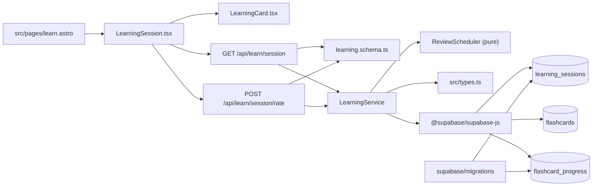

# Artefakt 2: struktura aktywnego obszaru

## Pytanie

Jak przepływa feature „sesja nauki → karta → rating → harmonogram” i gdzie narusza granice warstw?

Analiza jest celowo zawężona. `dependency-cruiser` nie jest zależnością projektu ani lokalną komendą, dlatego nie pobierano go ad hoc. Graf oparto na aktualnych importach (`rg '^import .* from'`) oraz call-site'ach zweryfikowanych `ast-grep 0.43.0`.

## Podgraf zależności



## Granice

| Granica                     | Stan                  | Dowód                                                                       |
| --------------------------- | --------------------- | --------------------------------------------------------------------------- |
| Astro → React island        | jawna                 | `src/pages/learn.astro:4,14` importuje `LearningSession` jako `client:load` |
| UI → API                    | jawna, ręczne `fetch` | `LearningSession.tsx:28-40` i `:62-78`                                      |
| API → validation            | jawna                 | `session.ts:3-4,63-66`, `rate.ts:3-4,20-29`                                 |
| API → service               | jawna                 | dokładnie dwa produkcyjne `new LearningService(...)`                        |
| service → scheduling        | wydzielona w fazie 1  | `learning.service.ts:3,6-9,170-176`                                         |
| service → persistence       | nieszczelna           | `LearningService` zna Supabase SDK i nazwy trzech tabel                     |
| persistence → authorization | niespójna             | kod filtruje `user_id`, ale końcowa migracja wyłącza RLS tabel nauki        |

## Cykle i testowalność

- W zawężonym grafie importów nie ma cyklu.
- `ReviewScheduler` nie importuje Astro, Supabase ani DTO; jest czystym liściem grafu.
- `LearningService` pozostaje trudny do testowania przez fluent mock Supabase i jednoczesną odpowiedzialność za query, mutacje oraz kompozycję DTO.
- `src/types.ts` jest wspólnym workiem DTO dla wielu feature'ów. Zmiana kształtu sesji może dotknąć API i UI bez lokalnej granicy typu.
- UI zawiera `setTimeout(1500)` przed kolejnym GET (`LearningSession.tsx:79-83`), co zwiększa czas i kruchość E2E.

## Mechaniczna weryfikacja

```bash
ast-grep run --lang ts --pattern 'new LearningService($SUPABASE)' src/pages/api/learn
# 2: session.ts:65, session/rate.ts:23

ast-grep run --lang ts --pattern '$SERVICE.getNextCard($$$ARGS)' src/pages/api/learn
# 1 produkcyjny call-site: session.ts:66

ast-grep run --lang ts --pattern '$SERVICE.rateFlashcard($$$ARGS)' src/pages/api/learn
# 1 produkcyjny call-site: session/rate.ts:24

ast-grep run --lang ts --pattern '$DB.from("learning_sessions")' src
# 4 wystąpienia, wszystkie LearningService

ast-grep run --lang ts --pattern '$DB.from("flashcard_progress")' src
# 4 wystąpienia: 3 LearningService + reset w endpointzie GET

rg -n 'new LearningService|getNextCard\(|rateFlashcard\(' src
# kontrola literalna potwierdziła wyniki; dodatkowe trafienia są w testach
```

## Ryzyka strukturalne

1. Nie ma reprezentacji „karta przedstawiona w sesji”, więc endpoint ratingu nie może sprawdzić kluczowego niezmiennika.
2. Pobranie karty wykonuje zapis do `learning_sessions`, mimo semantyki GET.
3. `reset=true` także mutuje dane przez GET.
4. Upsert postępu i licznik sesji nie są wspólną transakcją.
5. Typy Supabase przenikają do serwisu aplikacyjnego; planowany ACL jest w `context/domain/03-anti-corruption-layer.md`.

## Unknown

- Czy hosted Supabase posiada dodatkowe ręczne polityki/migracje niewersjonowane w repo.
- Czy adapter Supabase faktycznie wykonuje join `flashcard_progress!left` z oczekiwanym kształtem przy RLS.
- Czy celowe było losowanie z PRD; implementacja wybiera pierwszą najstarszą kartę.
